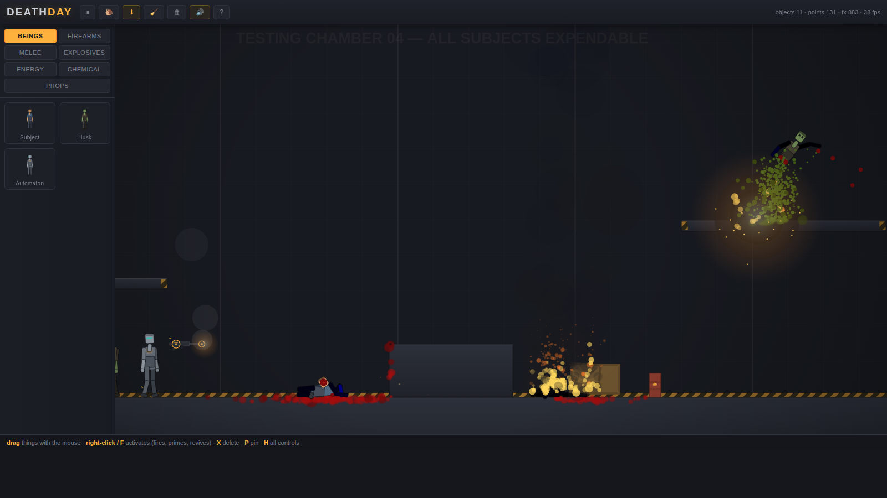
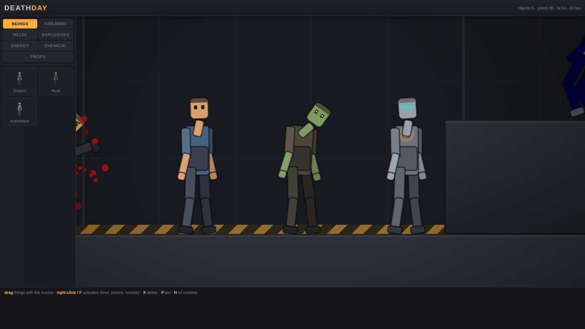
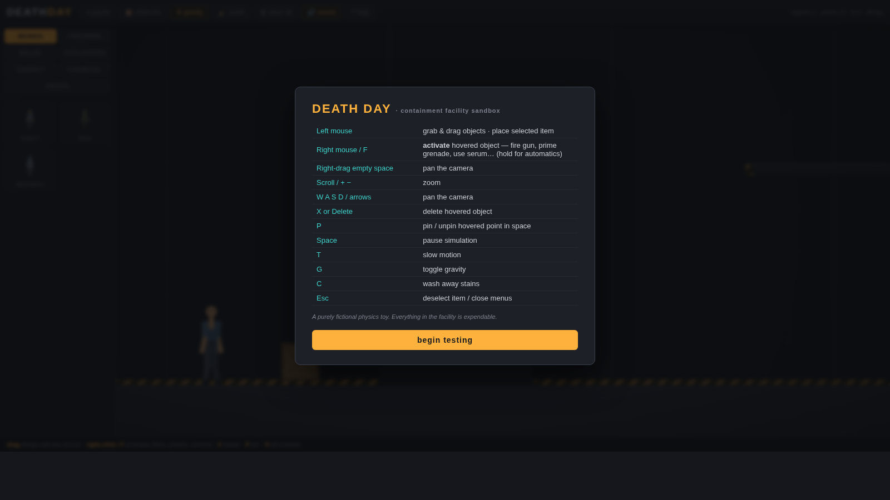

# DEATH DAY

A 2D ragdoll physics sandbox in the spirit of *People Playground*, with its own
identity: you run **Testing Chamber 04** of a containment facility, and
everything in it is expendable. Built entirely from scratch in vanilla
JavaScript — including the physics engine. **Zero dependencies, no build step.**



## Play

Open `index.html` in any modern browser. That's it — it runs from `file://`,
no server or install required.

## What's in the chamber



| Category | Items |
|---|---|
| **Beings** | Subject (human analogue), Husk (necrotic — shrugs off bullets, only decapitation stops it), Automaton (bleeds oil, sparks, overloads under electricity) |
| **Firearms** | PD-9 Pistol, Wasp SMG (full-auto), Mule Shotgun, Longhorn Rifle (over-penetrates) |
| **Melee** | Shiv, Splitter Axe, Moonfang katana — cut at speed, sever at high speed |
| **Explosives** | Pineapple grenade (3s fuse), Thumper det-pack, Toecutter mine, Powder Drum (chain-reacts, ignites) |
| **Energy** | Cattleprod (electrocution + convulsions), Firebrand (sets anything flammable alight) |
| **Chemical** | Nano Serum (revives the dead — if the head is still attached), Acid Flask (shatters on impact, melts flesh) |
| **Props** | Wooden crate (splinters, burns), steel block, plank, bouncer ball, wheel |

## The gore systems

- **Dismemberment** — every joint is a breakable constraint. Tear limbs off by
  hand, by blade, by blast, or by sheer momentum. Stumps bleed.
- **Blood** — wounds bleed and drain a finite blood reserve; droplets splat into
  permanent stains on floors and walls (press **C** to wash).
- **Fire** — spreads by contact, chars skin and wood progressively, burns
  victims down over time.
- **Electricity** — convulsions, arcing, and eventually a stopped heart.
- **Pain & death** — living subjects flail and wince; the dead go pale with
  X-ed eyes. The serum can bring them back.

## Alive, not just articulated

Living beings *stand* where you place them — balancing on skeletal "muscle"
constraints that switch off the instant they're stunned, electrocuted, or
dead, collapsing them into a full ragdoll. They breathe, blink, sway, shift
their weight and fidget; the Husk stands with a hunch, the Automaton at
rigid attention with a glowing core. Hard hits knock them off their feet
and they stay down — but prop a fallen survivor back upright and they will
find their footing again.

## Controls

| Input | Action |
|---|---|
| Left mouse | Grab & drag · place selected item |
| Right mouse / `F` | **Activate** hovered object — fire, prime, toggle, inject (hold for full-auto) |
| Right-drag empty space | Pan camera |
| Scroll / `+` `−` | Zoom |
| `W A S D` / arrows | Pan camera |
| `X` / `Delete` | Delete hovered object |
| `P` | Pin/unpin a point in space |
| `Space` | Pause |
| `T` | Slow motion |
| `G` | Toggle gravity |
| `C` | Wash away stains |
| `M` | Mute |
| `H` | Help |
| `Esc` | Deselect / close menus |



## How it works

- `js/physics.js` — custom Verlet integrator: round particles + distance
  constraints, substepped solver, spatial-hash collisions, breakable joints,
  raycasts. Ragdolls are jointed particle skeletons; crates are braced corner
  frames — which is why dismemberment and splintering come for free.
- `js/ragdoll.js` — subject anatomy, hit points, blood, pain reflexes,
  severing, burning, electrocution, death & revival, and rendering.
- `js/items.js` — the full catalogue; each item is a particle body with its own
  behaviour and renderer (the spawn-menu thumbnails are drawn by the same
  renderer, so the menu never lies).
- `js/effects.js` — blood/sparks/smoke/flame/tracers/arcs, plus the
  half-resolution stain canvas the world is slowly painted onto.
- `js/game.js` — the facility: simulation loop, camera, tools & input,
  explosions, fire spread, blade/shock/impact contact rules.
- `js/audio.js` — all sound is synthesized live with WebAudio; no assets.

## Tests

```
node test/smoke.js
```

Boots the whole game against a stubbed DOM, spawns every item, fires every
weapon, detonates every explosive, severs/burns/shocks/revives a subject, and
soaks the simulation for NaN poisoning. `test/visual.html` is a scripted scene
for headless screenshot verification.

---

*A purely fictional physics toy, in the tradition of ragdoll sandboxes.
No real subjects were harmed.*
